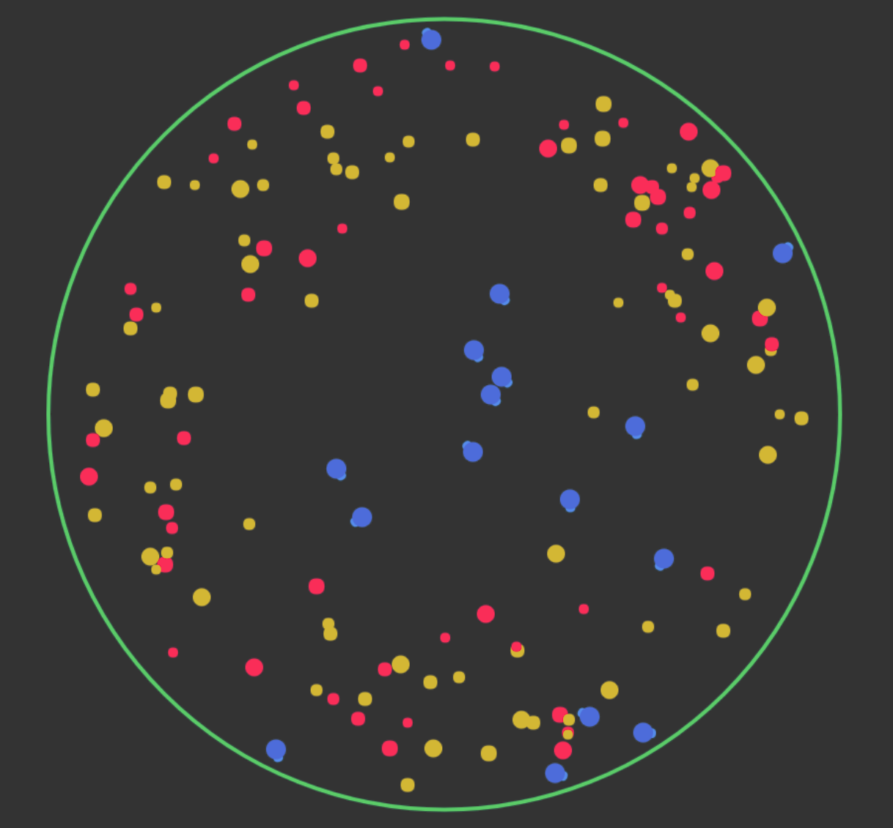

# Week 1: Revisiting 2d hungry creatures

# Lessons

* I should limit the new things (python server+websockets, reinforcement learning)
  Messing around with websockets for a few days meant I didn't even get a chance to try RL
* More defined mini-goals might help, I didn't find my "daily tasks" motivating at all
* And... Genetic algorithm doesn't seem to work well on this conv net
* But this was fun and I want to keep going!

# Plans

I plan to pick up on my exploration of evolving behaviors in simulated creatures; this time with reinforcement learning.

## Goal

* A single agent, controlled by a conv net, who learns *within* his lifetime
* Environment has positive (food) and negative (lava?) reward
* Input is "vision," stochastically updated each frame by a single(?) ray
* Ray picks up color(2 colors), and distance
* Photo-receptor has a decay-term that is reset each time it is updated

## Tools

* Try out python on the backend
* pytorch for learning model
* Transmit by websockets to an HTML5 canvas
* Simple interface for viewing inputs, outputs, environment

## Daily tasks

### Monday
- [ ] Python web server
- [ ] Python websockets

### Tuesday
- [ ] Random-motion test agent
- [ ] Environment objects (red and yellow circles, big green border)
- [ ] Broadcast to canvas

### Wednesday
- [ ] Inputs and outputs (vision)
- [ ] Visual of input and output
- [ ] Define the pytorch model (no training)

### Thursday
- [ ] Deep-q learning

### Friday
- [ ] Deep-q learning cont'd

### Saturday
- [ ] Loose ends and tidying up
